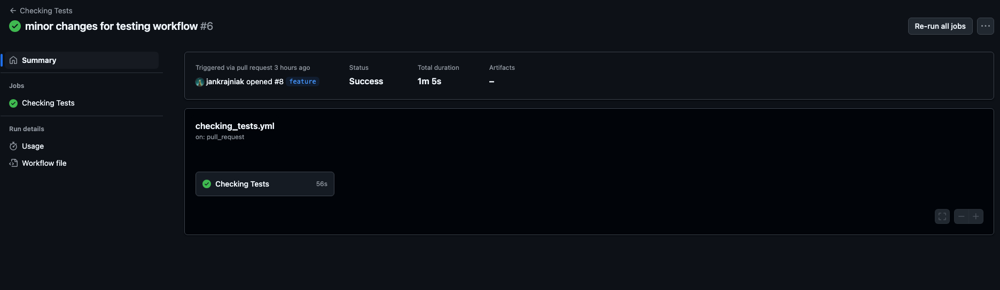
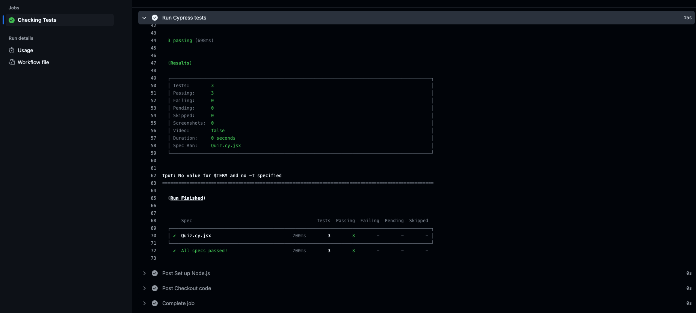
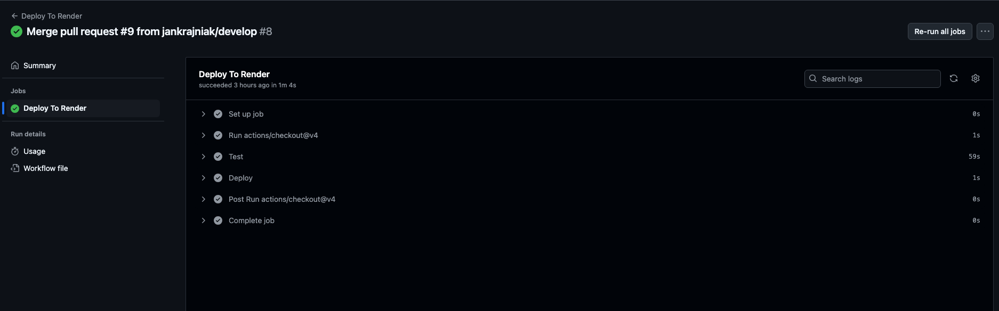

# CI/CD Popeline with GitHub Actions for Cypress Testing and Render Deployment

## Table of Contents
- [Descriptionn](#description)
- [Installation Instructions](#installation-instructions)
- [How to Use the App](#how-to-use-the-app)
- [Contribution Guidelines](#contribution-guidelines)
- [Test Instrustions](#test-instructions)
- [Questions](#questions)
- [Additional Information](#additional-information)

## Description
- This project demonstrates the creation of a CI/CD pipeline 
- The pipeline is set up such that a merge request into the main branch triggers Cypress testing and automatic deployment to Render
- A pull request into the develop branch triggers Cypress testing
- The automatic tasks are managed via GitHub actions
- A link to a GitHub GIST tutorial is included below

## Installation Instructions
- The code for the application in this project is included in the repository
- All relevant packages should be installed using the command "npm install"
- To properly configure your repository to implement the CI/CD pipeline, please follow the GIST tutorial

## How to Use the App
- The application itself is a web-service based quiz on the Python coding language
- To develop new features, use the feature branch (git checkout -b feature)
- All new features should first be integrated into the develop branch (via a pull request)
- Only a pull request into the main branch will automatically deploy the app to Render

## Contribution Guidelines
- Application code provided by the UNC Coding Bootcamp. CI/CD pipeline configuration (.github/workflows) provided by Jan Krajniak

## Test Instructions
- Test is implemented via Cypress. The implementation runs a component test.
- The "npm run test" command requires the server to be running
- The "npm run test-component" command runs the component test

## Questions
- My GitHub username: jankrajniak
- My email address: jan.krajniak@gmail.com
- Additional instructions on how to contact me:
  - If you wish to contact me, please email me at the above provided email address

## License
- This project is licensed under the MIT license: 

## Additional information

  ### Link to GIST tutorial
  https://gist.github.com/jankrajniak/84263678432647d4a0f389223cdf529c

  ### Screenshots
  

  

  